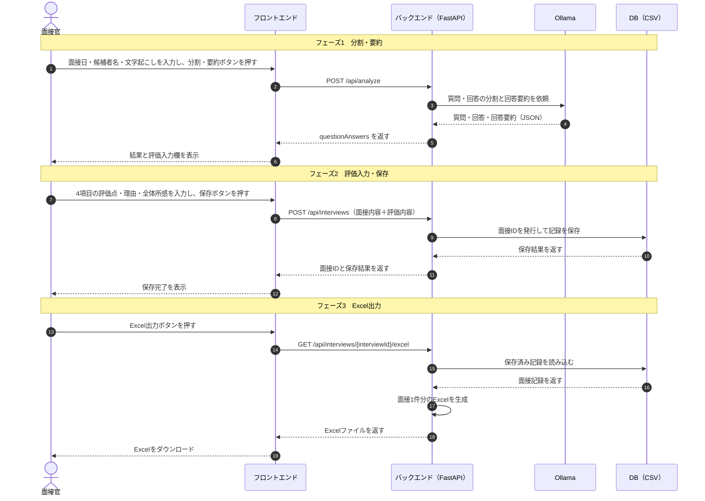
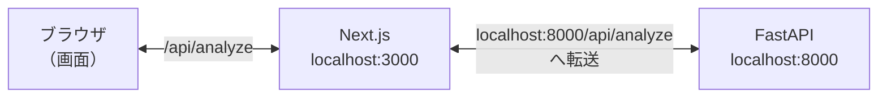

# 面接評価支援システム MVP仕様書

## 1. MVPで行うこと

```text
面接日・候補者名・文字起こしを入力
        ↓
質問と回答に分割し、回答を短く要約
        ↓
面接官が4項目を評価
        ↓
保存またはExcel出力
```

AIは質問・回答の分割と回答の要約にだけ使用し、評価や合否判定は行わない。

| 優先度 | 対象 |
| --- | --- |
| 必須 | タスク1～3：入力、分割・要約、評価、保存、Excel出力 |
| できれば対応 | タスク4：過去記録の表示・比較、タスク5：音声の文字起こし |

## 2. システムの担当

| 担当 | 役割 |
| --- | --- |
| フロントエンド | 入力画面、結果表示、評価入力、Excelダウンロード |
| バックエンド（FastAPI） | 現在の `main.py` はExcelダウンロードAPIを提供し、`storage.py` でDB（CSV）を読み込み、`excel.py` でpandasによるExcel生成を行う |
| Ollama | 質問・回答の分割、回答ごとの要約 |
| DB（CSV） | 面接記録の内部保存 |

FastAPIはバックエンドを作るためのPythonフレームワークである。

## 3. MVPの処理・画面遷移



MVPでは、別画面ではなく1画面内のステップ切り替えでもよい。

## 4. タスク別INPUT・OUTPUT

### 使用する型（仮）

```ts
type date = string; // YYYY-MM-DD形式

type QuestionAnswer = {
  questionNo: number;
  question: string;
  answer: string;
  answerSummary: string;
};

type EvaluationItemId =
  | "logical_thinking"
  | "communication"
  | "collaboration"
  | "enthusiasm";

type EvaluationResult = {
  evaluationItemId: EvaluationItemId;
  score: number; // 1～5
  reason?: string;
};

type InterviewRecord = {
  interviewId: string;
  interviewDate: date;
  candidateName: string;
  questionAnswers: QuestionAnswer[];
  evaluationResults: EvaluationResult[];
  overallComment?: string;
};

type AnalyzeRequest = {
  transcript: string;
};

type AnalyzeResponse = {
  questionAnswers: QuestionAnswer[];
};

type SaveInterviewRequest = Omit<InterviewRecord, "interviewId">;

type SaveInterviewResponse = {
  interviewId: string;
  saveStatus: boolean;
};
```

`QuestionAnswer[]` の `[]` は、質問・回答の組み合わせが複数入る配列を表す。

### タスク1：質問・回答の分割・要約

| 区分 | データ | 変数名（仮） | 型 | 必須 | 担当 |
| --- | --- | --- | --- | --- | --- |
| INPUT | 面接日 | `interviewDate` | `date` | 必須 | ユーザー → フロント |
| INPUT | 候補者名・識別名 | `candidateName` | `string` | 必須 | ユーザー → フロント |
| INPUT | 文字起こし全文 | `transcript` | `string` | 必須 | ユーザー → フロント → バックエンド |
| OUTPUT | 質問・回答（回答ごとの要約を含む） | `questionAnswers` | `QuestionAnswer[]` | - | バックエンド → フロント |

処理内容：

1. フロントからバックエンドへ文字起こしを送る。
2. バックエンドからOllamaへ文字起こしを送る。
3. Ollamaが質問と回答に分割し、回答を短く要約する。
4. フロントに一覧を表示する。

MVPでは、分割・要約された内容の手動修正と、話者ラベルがない文章からの話者推定は行わない。

#### 文字起こしの入力形式

各発言を改行し、行頭に `面接官:` または `応募者:` を付ける。コロンは半角 `:` に統一する。

```text
面接官: 志望理由を教えてください
応募者: これまでの開発経験を生かして、利用者の課題を解決したいと考えたためです。
面接官: チームで問題を解決した経験を教えてください
応募者: 進捗を毎日共有し、遅れている作業をメンバーで分担して完了させました。
```

`面接官:` と `応募者:` の両方が存在しない場合は `400 Bad Request` とする。

#### Ollamaの出力

OllamaにはJSON形式での出力を指定し、次の形だけを受け付ける。

```json
{
  "questionAnswers": [
    {
      "questionNo": 1,
      "question": "志望理由を教えてください",
      "answer": "これまでの開発経験を生かして、利用者の課題を解決したいと考えたためです。",
      "answerSummary": "開発経験を生かし、利用者の課題を解決したい。"
    }
  ]
}
```

- Ollamaの `format: json` を使用する。
- 回答要約は1～2文、80文字以内とする。
- JSONとして読み取れない場合は1回だけ再実行する。
- 再実行後も読み取れない場合は `500 Internal Server Error` とする。
- フロントとバックエンドの待ち時間上限は180秒とする。
- 処理中はローディング表示を出し、分割・要約ボタンを無効にする。
- デモでは上記程度の短い文字起こしを使用する。

### タスク2：面接官による評価入力

| 区分 | データ | 変数名（仮） | 型 | 必須 | 担当 |
| --- | --- | --- | --- | --- | --- |
| INPUT | 質問・回答（回答ごとの要約を含む） | `questionAnswers` | `QuestionAnswer[]` | 必須 | タスク1から受け取る |
| INPUT | 評価点 | `evaluationResults[].score` | `integer` | 必須 | ユーザー → フロント |
| INPUT | 評価理由 | `evaluationResults[].reason` | `string` | 任意 | ユーザー → フロント |
| INPUT | 全体の所感 | `overallComment` | `string` | 任意 | ユーザー → フロント |
| OUTPUT | 入力された評価内容 | `evaluationResults` | `EvaluationResult[]` | - | タスク3へ渡す |

「入力された評価内容」は、4項目それぞれの評価点と任意の評価理由をまとめたものを指す。

#### MVPの評価項目

| 固定ID | 評価項目 | 観点 |
| --- | --- | --- |
| `logical_thinking` | 論理性 | 結論と理由を筋道立てて説明できているか |
| `communication` | コミュニケーション能力 | 質問を理解し、分かりやすく回答できているか |
| `collaboration` | 協調性 | 周囲と協力して行動できるか |
| `enthusiasm` | 熱意 | 志望意欲や入社後に取り組む姿勢が感じられるか |

4つの固定IDを重複なくすべて送る。欠落、重複、1～5以外の評価点がある場合は `400 Bad Request` とする。

### タスク3：保存・Excel出力

保存とExcel出力は別ボタンにする。

#### タスク3A：保存

| 区分 | データ | 変数名（仮） | 型 | 必須 | 担当 |
| --- | --- | --- | --- | --- | --- |
| INPUT | 面接日 | `interviewDate` | `date` | 必須 | フロント → バックエンド |
| INPUT | 候補者名・識別名 | `candidateName` | `string` | 必須 | フロント → バックエンド |
| INPUT | 質問・回答（回答ごとの要約を含む） | `questionAnswers` | `QuestionAnswer[]` | 必須 | フロント → バックエンド |
| INPUT | 評価内容 | `evaluationResults` | `EvaluationResult[]` | 必須 | フロント → バックエンド |
| INPUT | 全体の所感 | `overallComment` | `string` | 任意 | フロント → バックエンド |
| OUTPUT | 面接ID | `interviewId` | `string` | - | バックエンド → フロント |
| OUTPUT | 保存結果 | `saveStatus` | `boolean` | - | バックエンド → フロント |

バックエンドは `INT-0001` 形式の連番で面接IDを発行し、DB（CSV）へ記録する。`interviews.csv` にある最大番号へ1を足して採番する。MVPは単一プロセスで使用し、同時保存は対象外とする。

#### タスク3B：Excel出力

| 区分 | データ | 変数名（仮） | 型 | 必須 | 担当 |
| --- | --- | --- | --- | --- | --- |
| INPUT | 保存済みの面接ID | `interviewId` | `string` | 必須 | フロント → バックエンド |
| OUTPUT | 候補者の面接記録 | `excelFile` | `Blob (.xlsx)` | - | バックエンド → ユーザー |

- 1回の面接（候補者1名）につき1ファイル出力する。
- 同じ候補者の別日面接と区別するため、ファイル名に候補者名と面接日を含める。
- ファイル名例：`面接記録_応募者A_20260903.xlsx`
- 未保存の内容はExcel出力しない。

### タスク4：過去記録の表示・比較（できれば対応）

| 区分 | データ | 変数名（仮） | 型 | 必須 | 担当 |
| --- | --- | --- | --- | --- | --- |
| INPUT | 面接日 | `searchDate` | `date` | 任意 | ユーザー → フロント → バックエンド |
| INPUT | 比較する面接記録 | `selectedInterviewIds` | `string[]` | 比較時必須 | ユーザー → フロント |
| OUTPUT | 保存済み面接記録 | `pastInterviews` | `InterviewRecord[]` | - | バックエンド → フロント |
| OUTPUT | 比較に使用する面接記録 | `comparisonData` | `InterviewRecord[]` | - | フロントに表示 |

- 面接日が未入力の場合は、すべての記録を表示する。
- MVPでは選択した記録を横並びに表示するだけとする。
- AIによる比較コメントやランキングは作成しない。

### タスク5：音声の文字起こし（できれば対応）

| 区分 | データ | 変数名（仮） | 型 | 必須 | 担当 |
| --- | --- | --- | --- | --- | --- |
| INPUT | 面接の音声 | `audioFile` | `File` | 必須 | ユーザー → フロント → バックエンド |
| OUTPUT | 文字起こし全文 | `transcript` | `string` | - | バックエンド → フロント |

- 生成した文字起こしをタスク1の入力欄へ渡す。
- タスク5を実装しない場合は、ユーザーが文字起こし済みテキストを直接入力する。
- 対応する音声形式と文字起こし方法は実装時に決める。

## 5. API仕様

フロントエンドとバックエンドは、この章を接点としてそれぞれ独立して実装する。

APIで送受信するJSONのキーは `camelCase` に統一する。Python内部とDB（CSV）の列名は `snake_case` とし、Pydanticの `alias_generator` でバックエンド内部に変換処理を閉じ込める。

エラー時のHTTPステータスは8章に従う。

### 起動ポートと通信経路

#### フロントとバックは別々に起動する

ポートとは、1台のPCの中で動いているプログラムを区別するための番号である。同じ番号を2つのプログラムが同時に使うことはできないため、フロントエンドとバックエンドはそれぞれ別の番号で起動する。開発中は2つを同時に立ち上げておく。

| 対象 | 起動コマンド | URL |
| --- | --- | --- |
| フロントエンド（Next.js） | `npm run dev` | `http://localhost:3000` |
| バックエンド（FastAPI） | `uvicorn main:app --reload` | `http://localhost:8000` |

`uvicorn` は、FastAPIで書いたプログラムをWebサーバーとして動かすためのソフトである。どちらのコマンドも、ポート番号を指定しなければ上記の番号で起動する。

#### 画面からバックエンドを直接呼ぶと失敗する

ブラウザには、表示中のページと違うURLへ勝手に通信させない仕組みがある。`http://localhost:3000` で開いた画面から `http://localhost:8000` を直接呼ぶと、**ポート番号が違うだけで別のサイト扱いになり、ブラウザ側で通信が止められる**。

これを回避する設定を「CORS」と呼ぶが、MVPでは次の方法を使うため設定しない。

#### Next.jsに中継させる

画面からは常に `http://localhost:3000` だけを呼び、`/api/` で始まるURLはNext.jsが裏側でバックエンドへ転送する。



ブラウザから見ると通信相手は `localhost:3000` の1つだけなので、上記の制限にかからない。転送の設定はNext.js側に次の1か所だけ書く。

```ts
// frontend/next.config.ts
const nextConfig: NextConfig = {
  async rewrites() {
    return [
      { source: "/api/:path*", destination: "http://localhost:8000/api/:path*" },
    ];
  },
};
```

#### この方式で決まること

- フロントエンドは `fetch("/api/analyze")` と書く。`http://localhost:8000` をコード中に書かない。
- CORSの設定は不要とする。
- Excelのダウンロードもそのまま動く。
- バックエンドだけを確認したいときは `http://localhost:8000/docs` を開く。FastAPIが自動生成する動作確認用の画面で、フロントエンドが未完成でもAPIを試せる。
- フロントエンドとバックエンドを別のPCで動かす場合はこの前提が崩れるが、MVPでは対象外とする。

### エンドポイント一覧

| 優先度 | Method | エンドポイント | INPUT | OUTPUT |
| --- | --- | --- | --- | --- |
| 必須 | `POST` | `/api/analyze` | `AnalyzeRequest` | `AnalyzeResponse` |
| 必須 | `POST` | `/api/interviews` | `SaveInterviewRequest` | `SaveInterviewResponse` |
| 必須 | `GET` | `/api/interviews/{interviewId}/excel` | URL内の `interviewId` | `.xlsx` ファイル |
| できれば対応 | `GET` | `/api/interviews?date=YYYY-MM-DD` | 任意の `date` | `{ "pastInterviews": InterviewRecord[] }` |
| できれば対応 | `POST` | `/api/transcribe` | `multipart/form-data` の `audioFile` | `{ "transcript": string }` |

### `POST /api/analyze`

文字起こしをOllamaへ渡し、質問・回答へ分割して回答を要約する。この時点では保存しない。

リクエスト：

```json
{
  "transcript": "面接官: 志望理由を教えてください\n応募者: これまでの開発経験を生かして、利用者の課題を解決したいと考えたためです。"
}
```

レスポンス（`200 OK`）：

```json
{
  "questionAnswers": [
    {
      "questionNo": 1,
      "question": "志望理由を教えてください",
      "answer": "これまでの開発経験を生かして、利用者の課題を解決したいと考えたためです。",
      "answerSummary": "開発経験を生かし、利用者の課題を解決したい。"
    }
  ]
}
```

- 面接日と候補者名は分割・要約に使わないため送らない。フロントで保持し、保存時にまとめて送る。
- `questionNo` は1から始まる連番とし、配列は昇順で返す。

### `POST /api/interviews`

面接内容と評価内容を受け取る。`main.py` で入力を検証し、`storage.py` で面接IDを発行してDB（CSV）へ記録する。

リクエスト：

```json
{
  "interviewDate": "2026-09-03",
  "candidateName": "応募者A",
  "questionAnswers": [
    {
      "questionNo": 1,
      "question": "志望理由を教えてください",
      "answer": "これまでの開発経験を生かして、利用者の課題を解決したいと考えたためです。",
      "answerSummary": "開発経験を生かし、利用者の課題を解決したい。"
    }
  ],
  "evaluationResults": [
    { "evaluationItemId": "logical_thinking", "score": 3 },
    { "evaluationItemId": "communication", "score": 4, "reason": "任意の理由" },
    { "evaluationItemId": "collaboration", "score": 4 },
    { "evaluationItemId": "enthusiasm", "score": 5 }
  ],
  "overallComment": "全体の所感"
}
```

レスポンス（`200 OK`）：

```json
{
  "interviewId": "INT-0001",
  "saveStatus": true
}
```

- `evaluationResults` は4つの固定IDを重複なくすべて含める。
- MVPでは追記のみとし、保存済み記録の更新・削除は行わない。保存完了後は保存ボタンを無効にする。

### `GET /api/interviews/{interviewId}/excel`

`storage.py` の `select()` で保存済みの面接記録を読み込み、`excel.py` でExcelファイルを生成して返す。レスポンスはJSONではなくファイル本体とする。

| ヘッダー | 値 |
| --- | --- |
| `Content-Type` | `application/vnd.openxmlformats-officedocument.spreadsheetml.sheet` |
| `Content-Disposition` | `attachment; filename*=UTF-8''<URLエンコードしたファイル名>` |

- ファイル名に日本語を含むため、`filename` ではなく `filename*` でURLエンコードして指定する。
- 指定した面接IDが存在しない場合は `404 Not Found` とする。

### `GET /api/interviews`（できれば対応）

保存済みの面接記録を一覧で返す。

| クエリパラメータ | 型 | 必須 | 説明 |
| --- | --- | --- | --- |
| `date` | `date` | 任意 | 面接日での絞り込み。未指定ならすべての記録を返す |

レスポンス（`200 OK`）：

```json
{
  "pastInterviews": [
    {
      "interviewId": "INT-0001",
      "interviewDate": "2026-09-03",
      "candidateName": "応募者A",
      "questionAnswers": [],
      "evaluationResults": [],
      "overallComment": "全体の所感"
    }
  ]
}
```

比較対象の絞り込み（`selectedInterviewIds`）と横並び表示はフロントエンド内で行い、専用のAPIは用意しない。

### `POST /api/transcribe`（できれば対応）

音声ファイルを受け取り、文字起こし全文を返す。`multipart/form-data` で `audioFile` を送る。

レスポンス（`200 OK`）：

```json
{
  "transcript": "面接官: 志望理由を教えてください\n応募者: これまでの開発経験を生かして、利用者の課題を解決したいと考えたためです。"
}
```

Ollamaは音声入力に対応しないため、実装する場合は文字起こし用のライブラリを別途用意する。

## 6. Excel出力仕様

Excelは1ファイル・1シートとする。

シート名：`面接記録`

Excelは利用者向けの面接記録とし、内部管理用の面接IDと評価内容は出力しない。
表データはpandasで作成し、`.xlsx` の書き込みエンジンとセルの装飾にはopenpyxlを使用する。

シート内を上から次の2区画に分ける。

### ① 基本情報

```text
面接日
候補者名
全体の所感
```

### ② 質問・回答

1つの質問・回答につき1行とする。

| 質問 | 回答（要約） |
| --- | --- |
| 志望理由を教えてください | 回答の短い要約 |

## 7. DB（CSV）の分割

過去記録の表示とExcel生成をしやすくするため、DBとして使用するCSVを3ファイルに分ける。

### `interviews.csv`

```text
interview_id,interview_date,candidate_name,overall_comment
```

### `question_answers.csv`

```text
interview_id,question_no,question,answer,answer_summary
```

### `evaluations.csv`

```text
interview_id,evaluation_item_id,score,reason
```

評価項目の日本語表示名は固定IDから変換する。3ファイルは `interview_id` で関連付ける。作成日時や更新日時などのメタ情報はMVPでは保存しない。

データアクセスは `storage.py` に集約し、`main.py` やほかの処理からCSVを直接操作しない。将来CSVからデータベースへ移行する場合に呼び出し側を大きく変更せずに済むよう、SQLライクなインターフェースを介してデータを操作する。

- Python標準の `csv` モジュールと `csv.QUOTE_MINIMAL` を使用する。
- ファイルは `encoding="utf-8"`、`newline=""` で読み書きする。内部DB用であり、利用者にはExcelを出力するためBOMは付けない。
- 回答、理由、所感に含まれるカンマ、ダブルクォート、改行は `csv` モジュールにエスケープさせる。
- 動作確認用のJSONとCSVは `test_data/` に格納する。実行時に `data/*.csv` へ追加されたレコードはコミットしない。

## 8. HTTPステータス

| HTTPステータス | 用途 | 画面表示例 |
| --- | --- | --- |
| `400 Bad Request` | 必須項目の不足、話者ラベル不正、評価4項目の不足・重複、評価点の範囲外 | 入力内容を確認してください |
| `404 Not Found` | 指定した面接記録が存在しない | 面接記録が見つかりません |
| `500 Internal Server Error` | OllamaのJSON解析、DB保存、Excel出力などバックエンド内部の処理失敗 | 処理に失敗しました |
| `502 Bad Gateway` | バックエンドからOllamaへの接続失敗・接続タイムアウト | Ollamaに接続できませんでした |

## 9. ディレクトリ構成

`main.py` はAPI受付と入力検証、`storage.py` はCSVへのデータアクセス、`excel.py` はExcel生成を担当する。

```text
sakura-hackason-teamA/
├── frontend/
│   └── app/                  # 入力・評価・出力画面
├── backend/
│   ├── main.py               # FastAPI起動・API受付・入力検証
│   ├── llm.py                # Ollamaによる分割・要約
│   ├── storage.py            # DB（CSV）のテーブル定義・読み書き
│   ├── excel.py              # Excelファイル生成
│   └── requirements.txt      # Python依存パッケージ
├── data/                     # DB（CSV）
│   ├── interviews.csv
│   ├── question_answers.csv
│   └── evaluations.csv
├── test_data/                # API・CSV処理の動作確認用データ
│   ├── save_interview_request.json
│   ├── interviews.csv
│   ├── question_answers.csv
│   └── evaluations.csv
├── docs/
│   └── mvp-interface-spec.md
├── .gitignore                # 仮想環境やデバッグ出力をGit管理外にする
└── README.md
```
