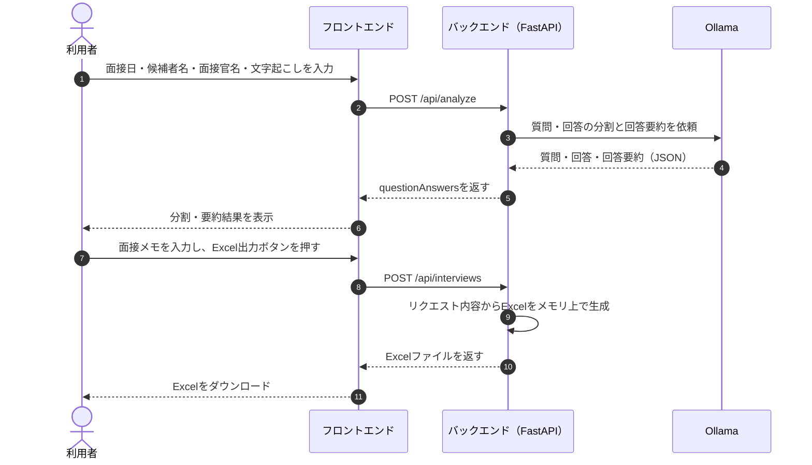

# 面接評価支援システム MVP仕様書

## 1. MVPで行うこと

```text
面接日・候補者名・面接官名・文字起こしを入力
        ↓
質問と回答に分割し、回答を短く要約
        ↓
面接メモを入力
        ↓
入力内容からExcelを生成してダウンロード
```

AIは質問・回答の分割と回答の要約だけに使用し、評価や合否判定は行わない。

入力内容はCSVやデータベースへ保存しない。Excelはリクエストを受けるたびにメモリ上で生成し、レスポンスとして返す。

## 2. システムの担当

| 担当 | 役割 |
| --- | --- |
| フロントエンド（Next.js） | 入力画面、分割・要約結果の表示、Excel出力リクエスト |
| バックエンド（FastAPI） | 入力検証、Ollamaの呼び出し、Excel生成とファイル返却 |
| Ollama | `qwen2.5:3b-instruct` による質問・回答の分割、回答要約 |
| pandas / openpyxl | Excelの表データ作成、書式設定 |

## 3. 処理フロー



この処理では面接IDを発行せず、入力内容を永続化しない。過去記録の一覧・検索・比較は対象外とする。

## 4. 使用する型

APIのJSONキーは `camelCase`、Python内部のフィールド名は `snake_case` とする。

```ts
type DateString = string; // YYYY-MM-DD

type QuestionAnswer = {
  questionNo: number;
  question: string;
  answer: string;
  answerSummary: string;
};

type AnalyzeRequest = {
  transcript: string;
};

type AnalyzeResponse = {
  questionAnswers: QuestionAnswer[];
};

type ExportInterviewRequest = {
  interviewDate: DateString;
  candidateName: string;
  interviewerName: string;
  questionAnswers: QuestionAnswer[];
  overallComment?: string;
};
```

フロントエンドの既存コードが送る `overallcomment` も互換性のため受け付ける。新しいコードでは `overallComment` を標準キーとする。

## 5. 質問・回答の分割・要約

### 入力

| データ | JSONキー | 型 | 必須 |
| --- | --- | --- | --- |
| 文字起こし全文 | `transcript` | `string` | 必須 |

空文字または空白だけの場合は `400 Bad Request` とする。

### 文字起こし形式

`面接官:`、`応募者:` の役割名を付けた形式に加え、Zoomの文字起こしのように時刻と参加者名だけが付いた形式も受け付ける。役割名がない場合、どちらが面接官かは発言内容から推定する。

```text
00:00:13 さくら太郎
これまで力を入れて取り組んだことを教えてください。

00:00:21 やまだ桜
大学のゼミで、地域の商店街を紹介するWebサイトを制作しました。
```

### Ollamaのモデルと出力

- モデル：`qwen2.5:3b-instruct`
- Ollamaの `format: json` を使用する。
- 回答要約は1～2文、80文字以内とする。
- JSONとして読み取れない場合は1回だけ再実行する。
- 再実行後も読み取れない場合は `500 Internal Server Error` とする。
- `questionNo` は1から始まる連番とする。

出力例：

```json
{
  "questionAnswers": [
    {
      "questionNo": 1,
      "question": "志望理由を教えてください",
      "answer": "開発経験を生かして、利用者の課題を解決したいと考えています。",
      "answerSummary": "開発経験を生かして利用者の課題を解決したい。"
    }
  ]
}
```

## 6. Excel出力API

### `POST /api/interviews`

面接日、候補者名、面接官名、分割・要約結果、面接メモを受け取り、DBへ保存せずExcelファイルを返す。

リクエスト：

```json
{
  "interviewDate": "2026-09-03",
  "candidateName": "応募者A",
  "interviewerName": "面接官A",
  "questionAnswers": [
    {
      "questionNo": 1,
      "question": "志望理由を教えてください",
      "answer": "開発経験を生かして、利用者の課題を解決したいと考えています。",
      "answerSummary": "開発経験を生かして利用者の課題を解決したい。"
    }
  ],
  "overallComment": "受け答えが明確だった。"
}
```

| 入力 | JSONキー | 型 | 必須 |
| --- | --- | --- | --- |
| 面接日 | `interviewDate` | `date` | 必須 |
| 候補者名 | `candidateName` | `string` | 必須 |
| 面接官名 | `interviewerName` | `string` | 必須 |
| 質問・回答・要約 | `questionAnswers` | `QuestionAnswer[]` | 1件以上 |
| 面接メモ | `overallComment` | `string` | 任意 |

`questionAnswers[].questionNo` は1から始まる連番とする。

レスポンスはJSONではなくExcelファイル本体とする。

| ヘッダー | 値 |
| --- | --- |
| `Content-Type` | `application/vnd.openxmlformats-officedocument.spreadsheetml.sheet` |
| `Content-Disposition` | `attachment; filename*=UTF-8''<URLエンコードしたファイル名>` |

ファイル名例：`面接記録_応募者A_20260903.xlsx`

### フロントエンド側の受け取り

`fetch()` はファイルを自動保存しない。レスポンスを `Blob` として読み込み、ブラウザ側でダウンロード処理を行う。

現行のリクエストに含まれない評価点と評価プロセスは、このAPIの入力およびExcel出力の対象外とする。

## 7. Excelファイル仕様

Excelは1ファイル・1シートとする。

- シート名：`面接記録`
- 表データの作成：pandas
- `.xlsx` の書き込みと装飾：openpyxl

### ① 基本情報

```text
面接日
候補者名
面接官名
全体の所感
```

### ② 質問・回答

1つの質問・回答につき1行とする。

| 質問 | 回答（要約） |
| --- | --- |
| 志望理由を教えてください | 開発経験を生かして利用者の課題を解決したい。 |

回答全文、評価点、評価理由はExcelへ出力しない。

## 8. データの扱い

- `POST /api/interviews` はCSVやデータベースを読み書きしない。
- 受け取ったデータはExcel生成時だけメモリ上で扱う。
- 生成したExcelもサーバーのディスクへ保存せず、`BytesIO` からレスポンスとして返す。
- リクエスト完了後に、入力内容をサーバー側から再取得することはできない。
- CSV用の `storage.py`、`data/*.csv`、DB保存関数は将来の再利用に備えて保持する。
- DB保存関数は現行APIのエンドポイントから呼び出さない。

## 9. エンドポイント一覧

| Method | エンドポイント | INPUT | OUTPUT |
| --- | --- | --- | --- |
| `POST` | `/api/analyze` | `AnalyzeRequest` | `AnalyzeResponse` |
| `POST` | `/api/interviews` | `ExportInterviewRequest` | `.xlsx` ファイル |
| `GET` | `/health` | なし | `{ "status": "ok" }` |

保存済みデータを前提とする `GET /api/interviews/{interview_id}/excel` は現行APIとして公開しない。DB保存処理自体は将来の再利用に備えて保持する。

## 10. HTTPステータス

| HTTPステータス | 用途 | 画面表示例 |
| --- | --- | --- |
| `400 Bad Request` | Excel出力リクエストの必須項目不足、質問番号の不整合 | 入力内容を確認してください |
| `404 Not Found` | 定義されていないAPIへアクセス | Not Found |
| `422 Unprocessable Entity` | 分析APIのJSON形式または型が不正 | FastAPIの入力検証エラー |
| `500 Internal Server Error` | Ollamaとの通信・JSON解析、Excel生成などの内部処理失敗 | 処理に失敗しました |

## 11. ディレクトリ構成

```text
sakura-hackathon-teamA/
├── frontend/
│   ├── app/
│   └── components/
├── backend/
│   ├── main.py               # 分析API、Excel出力API
│   ├── llm.py                # Ollamaによる分割・要約
│   ├── excel.py              # メモリ上でのExcel生成
│   ├── storage.py            # 旧CSV処理。現行APIからは未使用
│   └── requirements.txt
├── data/                     # 旧CSVデータ。現行APIからは未使用
├── test_data/
│   ├── analyze_transcript.txt
│   ├── analyze_transcript_zoom.txt
│   └── export_interview_request.json
├── docs/
│   └── mvp-interface-spec.md
└── README.md
```
